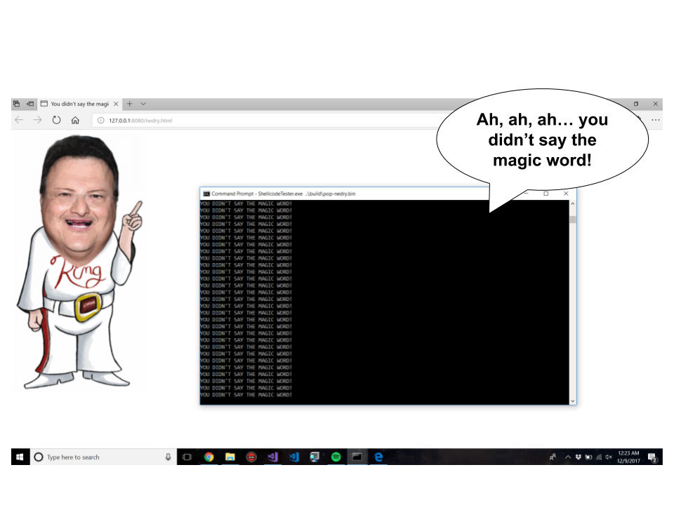

# "Pop Nedry" x86-64 Payload


# Description
Why pop calc, when you can pop Nedry!? This repository contains an x86-64 payload that recreates the Jurassic Park scene in which Dennis Nedry locks Ray Arnold out of his terminal. Upon execution it takes the following steps:
1. Allocates a console window with a call to `AllocConsole`
2. Outputs "YOU DIDN'T SAY THE MAGIC WORD" repeatedly with calls to `WriteConsoleA`
3. Dynamically loads `winmm.dll` and retrieves the procedure address for `PlaySoundA`
4. Loads the "Ah, Ah, Ah...You didn't say the magic word" audio from memory using `PlaySoundA`
5. Dynamically loads `shell32.dll` and retrieves the procedure address for `ShellExecuteA`
6. Opens the target's browser to a web page hosting the infamous Nedry GIF using `ShellExecuteA`
7. Sleeps for some time to let the audio play
8. Restores the stack and ret's

This truly is "Hacker crap".

# Building

## Build with Python script (Windows)
The python script is written for Windows. To run it make sure nasm and Python 2 are installed and added to your `PATH` environment variable. Then run the following command from the project's parent directory to generate a position independent shellcode binary:
```
> python build.py --outfile nedry.bin --url http://127.0.0.1:8080/nedry.html
```
This will compile the assembly, drop the binary in `.\build`, and write in the Nedry page URL.

## Manual build (Any OS)
You can also build the shellcode manually from any OS with nasm.
```
> cd .\src
> nasm -f bin -o pop-nedry.bin 
```
Once you've built the binary, you need to patch in your URL. To do so, open a hex editor and seek to `0x1dd`. Overwrite the NULL bytes with your URL. Make sure it starts with `http://` or `https://`. Do not use a URL that's more than 63 characters to ensure that you've left atleast one NULL to terminate the string.

# Test Usage
Build the shellcode binary
```
> python build.py --outfile nedry.bin --url http://127.0.0.1:8080/nedry.html
```

Start a Python web server to host the HTML Nedry page
```
> cd .\html
> python -m SimpleHTTPServer 8080
```

Test the shellcode with included ShellcodeTester.exe utilty (or your favorite exploit :P)
```
> cd .\utils
> ShellcodeTester.exe ..\build\nedry.bin
```

# Author(s)
* Brandon Miller ([@zznop_](https://twitter.com/zznop_))

# Additional Credit
* http://mikebrungs.com/sounds.htm for the WAV file
* Metasploit Project for the `api_call` routine